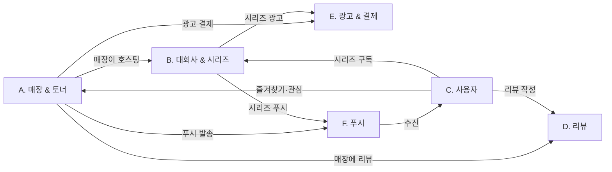
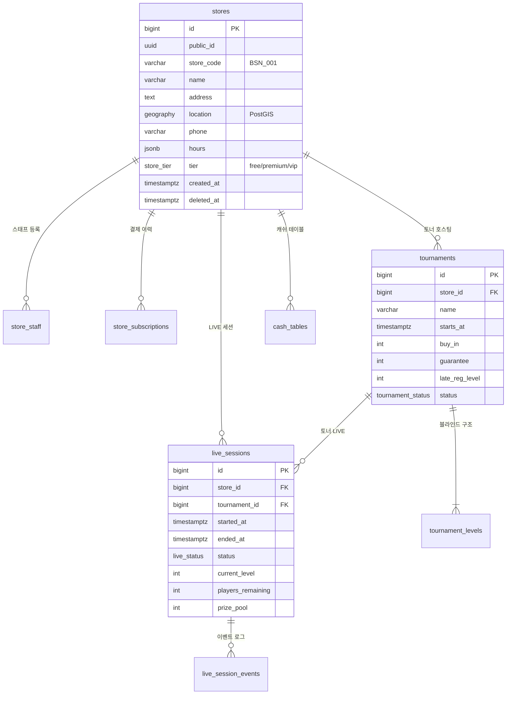
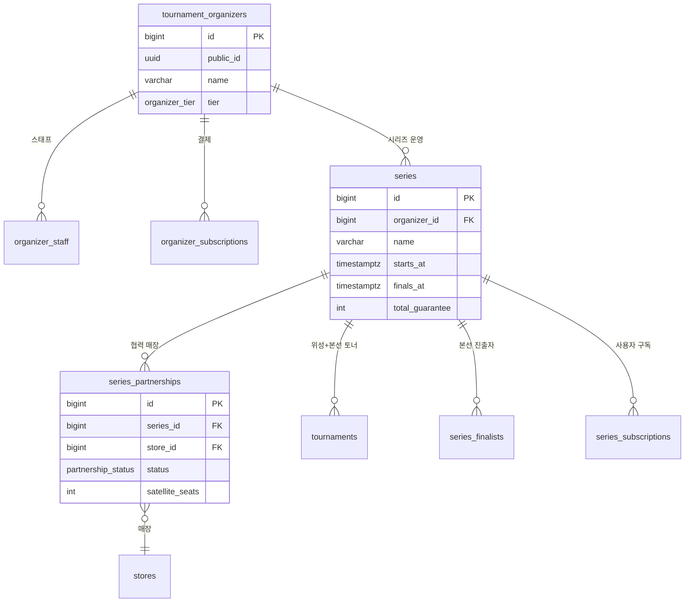
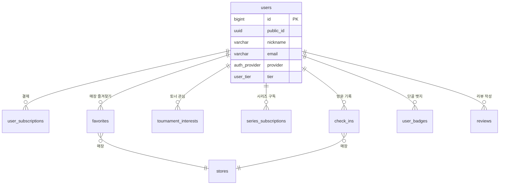
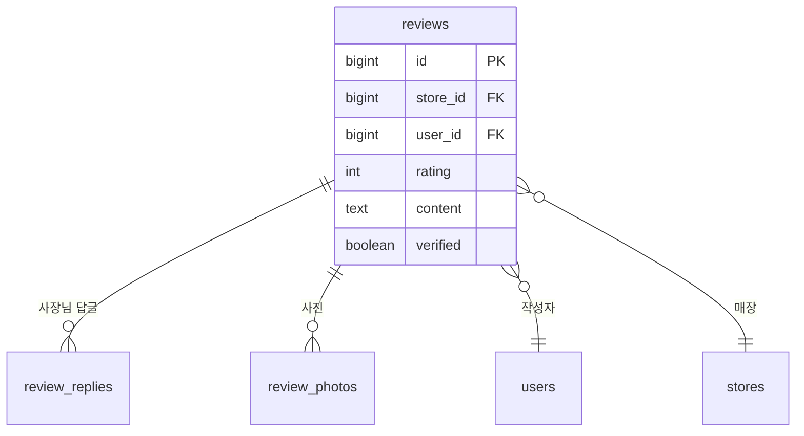
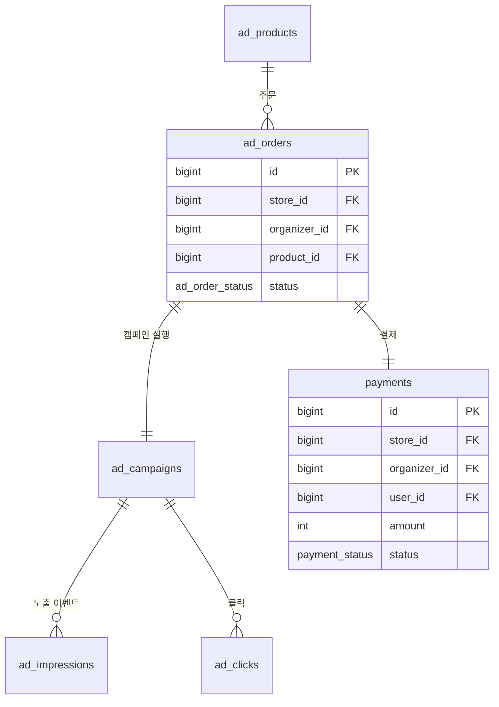

# HoldemNow DB 스키마 초안 v1.0

**문서 성격:** 데이터베이스 설계 초안. PostgreSQL 14+ 기준.
**작성 원칙:** 정규화 우선, 단 실시간 LIVE 송출 영역은 성능 우선으로 일부 비정규화 허용.

---

## 0. 설계 원칙

### 0.1 기본 규약
- **Primary Key:** 모든 테이블에 `id BIGSERIAL` 또는 `id UUID` (외부 노출 ID는 UUID)
- **Timestamp:** `created_at`, `updated_at` 모든 테이블 필수 (`TIMESTAMPTZ`)
- **Soft Delete:** 매장·사용자·결제 관련은 `deleted_at TIMESTAMPTZ NULL` 패턴
- **Naming:** snake_case, 테이블은 복수형 (`stores`, `tournaments`)
- **Enum:** PostgreSQL ENUM 타입 활용, 문자열보다 정합성·성능 우선

### 0.2 영역 구분
A. 매장 & 토너 (Core Domain)
B. 대회사 & 시리즈
C. 사용자
D. 리뷰 & 콘텐츠
E. 광고 & 결제
F. 푸시 & 알림

---

## 1. 전체 개요 다이어그램



---

# A. 매장 & 토너 (Core Domain)

이 영역이 본 앱의 심장. 다른 모든 영역이 매장(`stores`)과 토너먼트(`tournaments`)를 참조한다.

## A-1. ER 다이어그램



## A-2. `stores` — 매장

본 앱의 모든 디스커버리·LIVE의 출발점.

```sql
CREATE TYPE store_tier AS ENUM ('free', 'premium', 'vip');
CREATE TYPE store_status AS ENUM ('active', 'paused', 'closed');

CREATE TABLE stores (
    id              BIGSERIAL PRIMARY KEY,
    public_id       UUID NOT NULL DEFAULT gen_random_uuid() UNIQUE,
    store_code      VARCHAR(16) NOT NULL UNIQUE,         -- "BSN_001" 사장님에게 보이는 ID
    name            VARCHAR(80) NOT NULL,
    name_en         VARCHAR(80),
    description     TEXT,
    address         TEXT NOT NULL,
    address_detail  TEXT,
    region_code     VARCHAR(16) NOT NULL,                 -- "busan-seomyeon"
    location        GEOGRAPHY(POINT, 4326) NOT NULL,      -- PostGIS, 위경도
    phone           VARCHAR(20),
    hours           JSONB NOT NULL DEFAULT '{}',          -- 요일별 영업시간
    facilities      TEXT[],                                -- 주차/식사/24시간 등 태그
    thumbnail_url   TEXT,
    photo_urls      TEXT[] DEFAULT '{}',
    video_url       TEXT,
    tier            store_tier NOT NULL DEFAULT 'free',
    tier_expires_at TIMESTAMPTZ,                           -- 유료 만료일
    status          store_status NOT NULL DEFAULT 'active',
    avg_rating      NUMERIC(2,1) DEFAULT 0,                -- 캐싱된 평균 평점
    review_count    INT DEFAULT 0,                          -- 캐싱된 리뷰 수
    created_at      TIMESTAMPTZ NOT NULL DEFAULT NOW(),
    updated_at      TIMESTAMPTZ NOT NULL DEFAULT NOW(),
    deleted_at      TIMESTAMPTZ
);

CREATE INDEX idx_stores_region ON stores(region_code) WHERE deleted_at IS NULL;
CREATE INDEX idx_stores_tier ON stores(tier) WHERE deleted_at IS NULL AND status = 'active';
CREATE INDEX idx_stores_location ON stores USING GIST(location);
```

**설계 근거**
- `store_code`는 사람이 외울 수 있는 짧은 ID (어드민 로그인용)
- `public_id`는 URL·API 노출용 UUID (보안)
- `location` PostGIS GEOGRAPHY로 "내 위치에서 N km 이내" 쿼리 효율화
- `avg_rating`·`review_count`는 캐싱 — 매번 JOIN 계산하면 느림
- `tier_expires_at`로 유료 만료 처리 자동화

## A-3. `store_staff` — 스태프 계정

매장당 마스터 1 + 스태프 N개. 권한 분리.

```sql
CREATE TYPE staff_role AS ENUM ('owner', 'manager', 'staff');

CREATE TABLE store_staff (
    id              BIGSERIAL PRIMARY KEY,
    store_id        BIGINT NOT NULL REFERENCES stores(id) ON DELETE CASCADE,
    username        VARCHAR(40) NOT NULL,
    password_hash   TEXT NOT NULL,
    display_name    VARCHAR(40),
    role            staff_role NOT NULL DEFAULT 'staff',
    permissions     JSONB DEFAULT '{}',                    -- 세부 권한
    last_login_at   TIMESTAMPTZ,
    created_at      TIMESTAMPTZ NOT NULL DEFAULT NOW(),
    deleted_at      TIMESTAMPTZ,
    UNIQUE (store_id, username)
);

CREATE INDEX idx_store_staff_store ON store_staff(store_id) WHERE deleted_at IS NULL;
```

**설계 근거**
- `(store_id, username)` UNIQUE → 같은 매장 내에서만 username 유일하면 됨
- `role` ENUM으로 단순 분리. 세부 권한은 `permissions JSONB`에 (예: `{"can_start_live": true, "can_edit_tournaments": false}`)

## A-4. `tournaments` — 토너먼트

```sql
CREATE TYPE tournament_status AS ENUM (
    'draft',        -- 등록 중
    'scheduled',    -- 예약됨
    'registering',  -- 등록 중
    'running',      -- 진행 중
    'paused',       -- 일시 정지
    'finished',     -- 종료
    'cancelled'
);

CREATE TYPE tournament_type AS ENUM ('freezeout', 'rebuy', 'bounty', 'deepstack', 'turbo', 'satellite');

CREATE TABLE tournaments (
    id                  BIGSERIAL PRIMARY KEY,
    public_id           UUID NOT NULL DEFAULT gen_random_uuid() UNIQUE,
    store_id            BIGINT NOT NULL REFERENCES stores(id),
    name                VARCHAR(100) NOT NULL,
    tournament_type     tournament_type NOT NULL DEFAULT 'freezeout',
    description         TEXT,
    starts_at           TIMESTAMPTZ NOT NULL,
    starting_chips      INT NOT NULL DEFAULT 30000,
    buy_in              INT NOT NULL,                       -- 원화
    rebuy_amount        INT,
    rebuy_chips         INT,
    guarantee           INT NOT NULL DEFAULT 0,
    late_reg_minutes    INT DEFAULT 60,                     -- 시작 후 N분까지 등록
    late_reg_level      INT,                                 -- 또는 Level까지
    seat_capacity       INT,                                 -- 정원
    status              tournament_status NOT NULL DEFAULT 'scheduled',
    series_id           BIGINT REFERENCES series(id),       -- 시리즈 위성 예선인 경우
    is_satellite        BOOLEAN DEFAULT FALSE,
    satellite_seats     INT,                                 -- 본선 시드 수
    template_id         BIGINT REFERENCES tournament_templates(id),
    created_at          TIMESTAMPTZ NOT NULL DEFAULT NOW(),
    updated_at          TIMESTAMPTZ NOT NULL DEFAULT NOW(),
    deleted_at          TIMESTAMPTZ
);

CREATE INDEX idx_tournaments_store ON tournaments(store_id, starts_at);
CREATE INDEX idx_tournaments_starts_at ON tournaments(starts_at) WHERE status IN ('scheduled', 'registering', 'running');
CREATE INDEX idx_tournaments_series ON tournaments(series_id) WHERE series_id IS NOT NULL;
```

**설계 근거**
- `series_id`로 시리즈 연결 — 위성 예선 자동 집계의 기반
- `template_id`로 사장님이 만든 템플릿 재사용
- 부분 인덱스(`WHERE status IN (...)`)로 활성 토너만 빠르게 조회

## A-5. `tournament_levels` — 블라인드 구조

```sql
CREATE TABLE tournament_levels (
    id              BIGSERIAL PRIMARY KEY,
    tournament_id   BIGINT NOT NULL REFERENCES tournaments(id) ON DELETE CASCADE,
    level_number    INT NOT NULL,
    small_blind     INT NOT NULL,
    big_blind       INT NOT NULL,
    ante            INT DEFAULT 0,
    duration_minutes INT NOT NULL DEFAULT 20,
    is_break        BOOLEAN DEFAULT FALSE,
    break_duration_minutes INT,
    UNIQUE (tournament_id, level_number)
);

CREATE INDEX idx_levels_tournament ON tournament_levels(tournament_id, level_number);
```

**설계 근거**
- 토너 1개당 보통 18~25 레벨 → 별도 테이블이 정규화 측면에서 깔끔
- `is_break` 같은 행에 두면 휴식도 레벨 시퀀스의 일부로 처리됨 → 타이머 로직 단순화

## A-6. `tournament_templates` — 사장님 템플릿

```sql
CREATE TABLE tournament_templates (
    id              BIGSERIAL PRIMARY KEY,
    store_id        BIGINT NOT NULL REFERENCES stores(id),
    name            VARCHAR(80) NOT NULL,                  -- "프리징 90GTD 표준"
    is_system       BOOLEAN DEFAULT FALSE,                  -- 시스템 제공 템플릿
    starting_chips  INT NOT NULL DEFAULT 30000,
    levels          JSONB NOT NULL,                         -- 레벨 구조 JSON
    payout_structure JSONB,                                  -- 페이아웃 구조
    created_at      TIMESTAMPTZ NOT NULL DEFAULT NOW()
);

CREATE INDEX idx_templates_store ON tournament_templates(store_id);
```

**설계 근거**
- `levels` JSONB로 빠른 복사 — 토너 생성 시 한 번에 INSERT
- `is_system = TRUE` 행은 모든 매장이 공유

## A-7. `live_sessions` — LIVE 세션 (핵심)

**본 앱 핵심.** 매장이 타이머를 시작하는 순간 ROW 1개 생성, 종료 시 닫힘.

```sql
CREATE TYPE live_status AS ENUM ('active', 'paused', 'on_break', 'finished');

CREATE TABLE live_sessions (
    id                      BIGSERIAL PRIMARY KEY,
    public_id               UUID NOT NULL DEFAULT gen_random_uuid() UNIQUE,
    store_id                BIGINT NOT NULL REFERENCES stores(id),
    tournament_id           BIGINT NOT NULL REFERENCES tournaments(id),
    series_id               BIGINT REFERENCES series(id),   -- 시리즈 위성예선 컨텍스트
    status                  live_status NOT NULL DEFAULT 'active',
    started_at              TIMESTAMPTZ NOT NULL DEFAULT NOW(),
    ended_at                TIMESTAMPTZ,
    -- 실시간 상태 (높은 빈도 갱신)
    current_level           INT NOT NULL DEFAULT 1,
    level_started_at        TIMESTAMPTZ NOT NULL,
    level_paused_at         TIMESTAMPTZ,
    level_seconds_left      INT,                             -- 일시정지 시점 잔여
    players_registered      INT DEFAULT 0,
    players_remaining       INT,
    tables_remaining        INT,
    average_stack           INT,
    prize_pool              INT DEFAULT 0,
    late_reg_open           BOOLEAN DEFAULT TRUE,
    late_reg_closes_at      TIMESTAMPTZ,
    public_note             TEXT,                             -- 매장 공지 한 줄
    -- 집계용 (지표)
    viewer_count            INT DEFAULT 0,                    -- 현재 보는 모바일 유저
    peak_viewer_count       INT DEFAULT 0,
    total_view_count        INT DEFAULT 0,                    -- 누적 시청자
    created_at              TIMESTAMPTZ NOT NULL DEFAULT NOW(),
    updated_at              TIMESTAMPTZ NOT NULL DEFAULT NOW()
);

CREATE INDEX idx_live_active ON live_sessions(store_id) WHERE status IN ('active', 'paused', 'on_break');
CREATE INDEX idx_live_ended ON live_sessions(ended_at DESC) WHERE ended_at IS NOT NULL;
```

**설계 근거**
- **부분 인덱스 `WHERE status IN ('active'...)`** — "현재 LIVE 중인 매장 N개" 쿼리가 매우 빈번. 활성 세션은 항상 소수.
- `viewer_count` 같은 카운터는 별도 캐시(Redis) 권장, 본 테이블엔 1분 주기 동기화
- `tournament_id` NOT NULL → 토너 없이 LIVE는 시작 못 함 (캐쉬 게임은 별도 테이블)

## A-8. `live_session_events` — 이벤트 로그

타이머 모든 조작 이력. 감사·통계·복구용.

```sql
CREATE TYPE live_event_type AS ENUM (
    'started', 'paused', 'resumed', 'level_up', 'level_down',
    'time_added', 'time_removed', 'break_started', 'break_ended',
    'late_reg_closed', 'player_count_updated', 'stack_updated',
    'note_updated', 'finished'
);

CREATE TABLE live_session_events (
    id              BIGSERIAL PRIMARY KEY,
    live_session_id BIGINT NOT NULL REFERENCES live_sessions(id) ON DELETE CASCADE,
    event_type      live_event_type NOT NULL,
    payload         JSONB,                                    -- 이벤트별 상세
    triggered_by    BIGINT REFERENCES store_staff(id),        -- 누가 조작했는지
    created_at      TIMESTAMPTZ NOT NULL DEFAULT NOW()
);

CREATE INDEX idx_events_session ON live_session_events(live_session_id, created_at);
```

**설계 근거**
- 사장님이 실수로 시간 차감 → 이벤트 로그에 남아 있어 되돌리기 가능
- `payload`에 변경 전·후 값 저장 (예: `{"from": 1, "to": 2}` for level_up)

## A-9. `cash_tables` — 캐쉬게임 테이블

```sql
CREATE TYPE cash_table_status AS ENUM ('open', 'running', 'waiting', 'closed');

CREATE TABLE cash_tables (
    id              BIGSERIAL PRIMARY KEY,
    store_id        BIGINT NOT NULL REFERENCES stores(id),
    table_number    VARCHAR(8) NOT NULL,                     -- "1", "2", "A"
    game_type       VARCHAR(40) NOT NULL,                     -- "NLH 1/2"
    small_blind     INT NOT NULL,
    big_blind       INT NOT NULL,
    min_buyin       INT,
    max_buyin       INT,
    max_seats       INT DEFAULT 9,
    current_seats   INT DEFAULT 0,
    waiting_count   INT DEFAULT 0,
    status          cash_table_status NOT NULL DEFAULT 'closed',
    last_updated_at TIMESTAMPTZ DEFAULT NOW(),
    created_at      TIMESTAMPTZ NOT NULL DEFAULT NOW(),
    deleted_at      TIMESTAMPTZ
);

CREATE INDEX idx_cash_store ON cash_tables(store_id) WHERE deleted_at IS NULL;
```

---

# B. 대회사 & 시리즈

## B-1. ER 다이어그램



## B-2. `tournament_organizers` — 대회사

```sql
CREATE TYPE organizer_tier AS ENUM ('starter', 'pro', 'enterprise');

CREATE TABLE tournament_organizers (
    id              BIGSERIAL PRIMARY KEY,
    public_id       UUID NOT NULL DEFAULT gen_random_uuid() UNIQUE,
    name            VARCHAR(80) NOT NULL,
    legal_name      VARCHAR(80),                              -- 법인명
    business_number VARCHAR(20),                              -- 사업자번호
    description     TEXT,
    logo_url        TEXT,
    contact_name    VARCHAR(40),
    contact_email   VARCHAR(120),
    contact_phone   VARCHAR(20),
    tier            organizer_tier NOT NULL DEFAULT 'starter',
    tier_expires_at TIMESTAMPTZ,
    status          VARCHAR(20) DEFAULT 'active',
    account_manager_user_id BIGINT,                           -- 전담 매니저 (운영팀)
    created_at      TIMESTAMPTZ NOT NULL DEFAULT NOW(),
    updated_at      TIMESTAMPTZ NOT NULL DEFAULT NOW(),
    deleted_at      TIMESTAMPTZ
);

CREATE INDEX idx_organizers_tier ON tournament_organizers(tier) WHERE deleted_at IS NULL;
```

## B-3. `series` — 시리즈

```sql
CREATE TYPE series_status AS ENUM ('draft', 'announced', 'ongoing', 'finals', 'finished', 'cancelled');

CREATE TABLE series (
    id                      BIGSERIAL PRIMARY KEY,
    public_id               UUID NOT NULL DEFAULT gen_random_uuid() UNIQUE,
    organizer_id            BIGINT NOT NULL REFERENCES tournament_organizers(id),
    name                    VARCHAR(120) NOT NULL,
    season                  VARCHAR(40),                       -- "2026 Spring"
    description             TEXT,
    main_visual_url         TEXT,
    starts_at               TIMESTAMPTZ NOT NULL,              -- 위성 예선 시작
    finals_starts_at        TIMESTAMPTZ NOT NULL,              -- 본선 시작
    finals_venue_id         BIGINT REFERENCES stores(id),      -- 본선 장소 (매장 또는 NULL)
    finals_venue_text       TEXT,                              -- 매장 외 장소면 자유 텍스트
    total_guarantee         BIGINT,
    finals_buy_in           INT,
    sponsors                JSONB DEFAULT '[]',                -- [{name, logo_url, url}]
    status                  series_status NOT NULL DEFAULT 'draft',
    seats_per_satellite_default INT DEFAULT 1,
    page_config             JSONB DEFAULT '{}',                -- 페이지 커스터마이징
    created_at              TIMESTAMPTZ NOT NULL DEFAULT NOW(),
    updated_at              TIMESTAMPTZ NOT NULL DEFAULT NOW(),
    deleted_at              TIMESTAMPTZ
);

CREATE INDEX idx_series_organizer ON series(organizer_id);
CREATE INDEX idx_series_active ON series(status) WHERE status IN ('announced', 'ongoing', 'finals');
```

## B-4. `series_partnerships` — 시리즈-매장 협력

```sql
CREATE TYPE partnership_status AS ENUM ('invited', 'accepted', 'declined', 'cancelled');

CREATE TABLE series_partnerships (
    id                  BIGSERIAL PRIMARY KEY,
    series_id           BIGINT NOT NULL REFERENCES series(id) ON DELETE CASCADE,
    store_id            BIGINT NOT NULL REFERENCES stores(id),
    status              partnership_status NOT NULL DEFAULT 'invited',
    satellite_seats     INT NOT NULL DEFAULT 1,                -- 본선 시드 수
    satellite_count     INT DEFAULT 0,                          -- 위성 예선 횟수
    invited_at          TIMESTAMPTZ NOT NULL DEFAULT NOW(),
    responded_at        TIMESTAMPTZ,
    UNIQUE (series_id, store_id)
);

CREATE INDEX idx_partnerships_series ON series_partnerships(series_id, status);
CREATE INDEX idx_partnerships_store ON series_partnerships(store_id, status);
```

## B-5. `series_finalists` — 본선 진출자

위성 예선에서 시드를 획득한 플레이어. **자동 집계의 핵심 결과물.**

```sql
CREATE TABLE series_finalists (
    id                  BIGSERIAL PRIMARY KEY,
    series_id           BIGINT NOT NULL REFERENCES series(id) ON DELETE CASCADE,
    user_id             BIGINT REFERENCES users(id),           -- 매칭된 경우
    nickname            VARCHAR(40) NOT NULL,                  -- 사장님이 입력
    source_tournament_id BIGINT REFERENCES tournaments(id),    -- 어느 위성에서 진출했나
    source_store_id     BIGINT REFERENCES stores(id),
    rank_in_satellite   INT,                                    -- 위성 예선 순위
    opt_in_public       BOOLEAN DEFAULT FALSE,                 -- 공개 동의 여부
    seat_number         VARCHAR(8),                            -- 본선 좌석 (추첨 후)
    final_rank          INT,                                    -- 본선 최종 순위
    prize_won           INT,                                    -- 본선 상금
    created_at          TIMESTAMPTZ NOT NULL DEFAULT NOW()
);

CREATE INDEX idx_finalists_series ON series_finalists(series_id);
CREATE INDEX idx_finalists_user ON series_finalists(user_id) WHERE user_id IS NOT NULL;
```

**설계 근거**
- `user_id` NULL 허용 — 매장이 닉네임만 입력했을 때
- `opt_in_public` — 본인 옵트인 안 한 사용자는 시리즈 페이지에 닉네임 비공개
- 같은 사용자가 같은 시리즈의 여러 위성에서 진출할 수 있으므로 UNIQUE 없음

## B-6. `organizer_staff`

매장 스태프와 동일한 구조의 대회사 운영팀.

```sql
CREATE TABLE organizer_staff (
    id              BIGSERIAL PRIMARY KEY,
    organizer_id    BIGINT NOT NULL REFERENCES tournament_organizers(id),
    username        VARCHAR(40) NOT NULL,
    password_hash   TEXT NOT NULL,
    display_name    VARCHAR(40),
    role            VARCHAR(20) NOT NULL DEFAULT 'staff',
    permissions     JSONB DEFAULT '{}',
    created_at      TIMESTAMPTZ NOT NULL DEFAULT NOW(),
    deleted_at      TIMESTAMPTZ,
    UNIQUE (organizer_id, username)
);
```

---

# C. 사용자 (Player)

## C-1. ER 다이어그램



## C-2. `users` — 사용자

```sql
CREATE TYPE auth_provider AS ENUM ('email', 'kakao', 'apple', 'guest');
CREATE TYPE user_tier AS ENUM ('free', 'premium');

CREATE TABLE users (
    id                  BIGSERIAL PRIMARY KEY,
    public_id           UUID NOT NULL DEFAULT gen_random_uuid() UNIQUE,
    nickname            VARCHAR(40) NOT NULL,                  -- 실명 X, 닉네임만
    nickname_normalized VARCHAR(40),                            -- 검색용 정규화
    email               VARCHAR(120) UNIQUE,
    password_hash       TEXT,                                    -- 이메일 가입 시
    auth_provider       auth_provider NOT NULL DEFAULT 'email',
    provider_user_id    VARCHAR(120),                            -- 카카오·애플 ID
    profile_image_url   TEXT,
    phone               VARCHAR(20),
    region_code         VARCHAR(16),
    tier                user_tier NOT NULL DEFAULT 'free',
    tier_expires_at     TIMESTAMPTZ,
    notification_token  TEXT,                                    -- FCM/APNS 토큰
    settings            JSONB DEFAULT '{}',
    last_active_at      TIMESTAMPTZ,
    created_at          TIMESTAMPTZ NOT NULL DEFAULT NOW(),
    updated_at          TIMESTAMPTZ NOT NULL DEFAULT NOW(),
    deleted_at          TIMESTAMPTZ
);

CREATE INDEX idx_users_nickname ON users(nickname_normalized);
CREATE INDEX idx_users_provider ON users(auth_provider, provider_user_id) WHERE provider_user_id IS NOT NULL;
CREATE INDEX idx_users_active ON users(last_active_at DESC) WHERE deleted_at IS NULL;
```

**설계 근거**
- `nickname_normalized` — 공백·대소문자 제거하여 본선 진출자 자동 매칭 정확도 ↑
- `provider_user_id` — 카카오/애플 로그인 시 외부 ID
- `notification_token`을 users에 두는 게 푸시 발송 쿼리 단순화 (단, 사용자가 여러 디바이스 시 별도 테이블 분리 필요)

## C-3. `favorites` — 매장 즐겨찾기

```sql
CREATE TABLE favorites (
    id              BIGSERIAL PRIMARY KEY,
    user_id         BIGINT NOT NULL REFERENCES users(id) ON DELETE CASCADE,
    store_id        BIGINT NOT NULL REFERENCES stores(id),
    notify_on_live  BOOLEAN DEFAULT TRUE,                      -- LIVE 시 푸시
    created_at      TIMESTAMPTZ NOT NULL DEFAULT NOW(),
    UNIQUE (user_id, store_id)
);

CREATE INDEX idx_favorites_user ON favorites(user_id);
CREATE INDEX idx_favorites_store_notify ON favorites(store_id) WHERE notify_on_live = TRUE;
```

**설계 근거**
- `idx_favorites_store_notify` 부분 인덱스 — LIVE 시작 시 알림 대상자 빠르게 조회
- "매장 X의 즐겨찾기 + LIVE 알림 ON 사용자" 쿼리가 푸시 발송 트리거의 핵심

## C-4. `tournament_interests` — 토너 관심 등록

```sql
CREATE TABLE tournament_interests (
    id              BIGSERIAL PRIMARY KEY,
    user_id         BIGINT NOT NULL REFERENCES users(id) ON DELETE CASCADE,
    tournament_id   BIGINT NOT NULL REFERENCES tournaments(id) ON DELETE CASCADE,
    notify_d_minus_1 BOOLEAN DEFAULT TRUE,
    notify_h_minus_1 BOOLEAN DEFAULT TRUE,
    notify_late_reg  BOOLEAN DEFAULT TRUE,
    created_at      TIMESTAMPTZ NOT NULL DEFAULT NOW(),
    UNIQUE (user_id, tournament_id)
);

CREATE INDEX idx_interests_tournament ON tournament_interests(tournament_id);
```

## C-5. `series_subscriptions`

```sql
CREATE TABLE series_subscriptions (
    id              BIGSERIAL PRIMARY KEY,
    user_id         BIGINT NOT NULL REFERENCES users(id) ON DELETE CASCADE,
    series_id       BIGINT NOT NULL REFERENCES series(id) ON DELETE CASCADE,
    notify_updates  BOOLEAN DEFAULT TRUE,
    notify_next_season BOOLEAN DEFAULT TRUE,
    created_at      TIMESTAMPTZ NOT NULL DEFAULT NOW(),
    UNIQUE (user_id, series_id)
);

CREATE INDEX idx_series_subs_series ON series_subscriptions(series_id);
```

## C-6. `check_ins` — 방문 체크인

```sql
CREATE TYPE check_in_method AS ENUM ('gps', 'qr', 'manual');

CREATE TABLE check_ins (
    id              BIGSERIAL PRIMARY KEY,
    user_id         BIGINT NOT NULL REFERENCES users(id),
    store_id        BIGINT NOT NULL REFERENCES stores(id),
    method          check_in_method NOT NULL,
    location        GEOGRAPHY(POINT, 4326),                    -- 체크인 시점 위치
    verified        BOOLEAN DEFAULT FALSE,
    created_at      TIMESTAMPTZ NOT NULL DEFAULT NOW()
);

CREATE INDEX idx_checkins_user_store ON check_ins(user_id, store_id);
CREATE INDEX idx_checkins_store_date ON check_ins(store_id, created_at);
```

**설계 근거**
- 단골 뱃지 자동 부여의 기반 데이터
- 리뷰 작성 권한 검증 (체크인 없으면 리뷰 못 씀)

## C-7. `user_badges` — 단골 뱃지

```sql
CREATE TYPE badge_type AS ENUM ('regular', 'vip_regular', 'series_finalist', 'review_helper');

CREATE TABLE user_badges (
    id              BIGSERIAL PRIMARY KEY,
    user_id         BIGINT NOT NULL REFERENCES users(id),
    store_id        BIGINT REFERENCES stores(id),              -- 매장별 단골 뱃지
    badge_type      badge_type NOT NULL,
    visit_count     INT,                                        -- 누적 방문 수
    granted_at      TIMESTAMPTZ NOT NULL DEFAULT NOW(),
    UNIQUE (user_id, store_id, badge_type)
);

CREATE INDEX idx_badges_user ON user_badges(user_id);
CREATE INDEX idx_badges_store ON user_badges(store_id) WHERE store_id IS NOT NULL;
```

---

# D. 리뷰 & 콘텐츠

## D-1. ER 다이어그램



## D-2. `reviews`

```sql
CREATE TABLE reviews (
    id              BIGSERIAL PRIMARY KEY,
    store_id        BIGINT NOT NULL REFERENCES stores(id),
    user_id         BIGINT NOT NULL REFERENCES users(id),
    check_in_id     BIGINT REFERENCES check_ins(id),           -- 체크인 검증
    rating          INT NOT NULL CHECK (rating BETWEEN 1 AND 5),
    content         TEXT NOT NULL,
    verified        BOOLEAN DEFAULT FALSE,                      -- 체크인 검증 여부
    is_hidden       BOOLEAN DEFAULT FALSE,                      -- 신고로 가려진
    helpful_count   INT DEFAULT 0,
    created_at      TIMESTAMPTZ NOT NULL DEFAULT NOW(),
    updated_at      TIMESTAMPTZ NOT NULL DEFAULT NOW(),
    deleted_at      TIMESTAMPTZ
);

CREATE INDEX idx_reviews_store ON reviews(store_id, created_at DESC) WHERE deleted_at IS NULL AND is_hidden = FALSE;
CREATE INDEX idx_reviews_user ON reviews(user_id);
```

## D-3. `review_photos`

```sql
CREATE TABLE review_photos (
    id              BIGSERIAL PRIMARY KEY,
    review_id       BIGINT NOT NULL REFERENCES reviews(id) ON DELETE CASCADE,
    photo_url       TEXT NOT NULL,
    order_index     INT DEFAULT 0
);
```

## D-4. `review_replies`

```sql
CREATE TABLE review_replies (
    id              BIGSERIAL PRIMARY KEY,
    review_id       BIGINT NOT NULL REFERENCES reviews(id) ON DELETE CASCADE,
    store_id        BIGINT NOT NULL REFERENCES stores(id),
    replied_by      BIGINT NOT NULL REFERENCES store_staff(id),
    content         TEXT NOT NULL,
    created_at      TIMESTAMPTZ NOT NULL DEFAULT NOW(),
    updated_at      TIMESTAMPTZ
);

CREATE INDEX idx_replies_review ON review_replies(review_id);
```

---

# E. 광고 & 결제

## E-1. ER 다이어그램



## E-2. `ad_products` — 광고 상품 카탈로그

```sql
CREATE TYPE ad_product_type AS ENUM (
    'subscription_premium', 'subscription_vip',                 -- 매장 구독
    'subscription_starter', 'subscription_pro', 'subscription_enterprise', -- 대회사 구독
    'one_shot_push', 'one_shot_featured', 'one_shot_banner',   -- 단발 매장
    'one_shot_series_banner', 'one_shot_full_banner',           -- 단발 대회사
    'one_shot_search_keyword',
    'user_premium'                                              -- 사용자 멤버십
);

CREATE TYPE buyer_type AS ENUM ('store', 'organizer', 'user');

CREATE TABLE ad_products (
    id              BIGSERIAL PRIMARY KEY,
    product_code    VARCHAR(40) NOT NULL UNIQUE,
    product_type    ad_product_type NOT NULL,
    buyer_type      buyer_type NOT NULL,
    name            VARCHAR(80) NOT NULL,
    description     TEXT,
    price           INT NOT NULL,                              -- 원화
    duration_days   INT,                                        -- 정기 결제 주기
    is_recurring    BOOLEAN DEFAULT FALSE,
    metadata        JSONB DEFAULT '{}',                         -- 노출 위치·횟수 등
    active          BOOLEAN DEFAULT TRUE,
    created_at      TIMESTAMPTZ NOT NULL DEFAULT NOW()
);
```

## E-3. `ad_orders` — 주문

```sql
CREATE TYPE ad_order_status AS ENUM ('pending', 'paid', 'active', 'completed', 'cancelled', 'refunded');

CREATE TABLE ad_orders (
    id                  BIGSERIAL PRIMARY KEY,
    public_id           UUID NOT NULL DEFAULT gen_random_uuid() UNIQUE,
    buyer_type          buyer_type NOT NULL,
    store_id            BIGINT REFERENCES stores(id),          -- buyer가 store면
    organizer_id        BIGINT REFERENCES tournament_organizers(id),
    user_id             BIGINT REFERENCES users(id),
    product_id          BIGINT NOT NULL REFERENCES ad_products(id),
    quantity            INT DEFAULT 1,
    unit_price          INT NOT NULL,                          -- 결제 시점 단가 (할인 반영)
    discount_amount     INT DEFAULT 0,
    final_amount        INT NOT NULL,
    status              ad_order_status NOT NULL DEFAULT 'pending',
    scheduled_start     TIMESTAMPTZ,                            -- 예약된 시작일
    scheduled_end       TIMESTAMPTZ,
    parameters          JSONB DEFAULT '{}',                     -- 광고 콘텐츠 (배너 URL, 메시지 등)
    created_at          TIMESTAMPTZ NOT NULL DEFAULT NOW(),
    updated_at          TIMESTAMPTZ NOT NULL DEFAULT NOW()
);

CREATE INDEX idx_orders_store ON ad_orders(store_id) WHERE store_id IS NOT NULL;
CREATE INDEX idx_orders_organizer ON ad_orders(organizer_id) WHERE organizer_id IS NOT NULL;
CREATE INDEX idx_orders_status ON ad_orders(status, scheduled_start);
```

## E-4. `ad_campaigns` — 활성 캠페인

주문(`ad_orders`)이 결제 완료되면 캠페인이 생성·실행됨.

```sql
CREATE TYPE campaign_status AS ENUM ('scheduled', 'running', 'paused', 'completed');

CREATE TABLE ad_campaigns (
    id              BIGSERIAL PRIMARY KEY,
    order_id        BIGINT NOT NULL REFERENCES ad_orders(id),
    starts_at       TIMESTAMPTZ NOT NULL,
    ends_at         TIMESTAMPTZ NOT NULL,
    status          campaign_status NOT NULL DEFAULT 'scheduled',
    target_region   VARCHAR(16),
    target_filter   JSONB,                                      -- 타깃팅 조건
    creative        JSONB NOT NULL,                             -- 배너 이미지, 카피 등
    impression_count BIGINT DEFAULT 0,                          -- 캐싱된 노출 수
    click_count     BIGINT DEFAULT 0,                            -- 캐싱된 클릭 수
    created_at      TIMESTAMPTZ NOT NULL DEFAULT NOW()
);

CREATE INDEX idx_campaigns_active ON ad_campaigns(status, starts_at, ends_at) WHERE status IN ('scheduled', 'running');
```

**설계 근거**
- `impression_count`·`click_count`는 분리된 `ad_impressions`/`ad_clicks` 테이블 집계를 캐싱
- 실시간 노출은 Redis 카운터로 처리 후 주기적 동기화

## E-5. `ad_impressions` & `ad_clicks` — 이벤트 로그

대용량 시계열. 파티셔닝 필수.

```sql
CREATE TABLE ad_impressions (
    id              BIGSERIAL,
    campaign_id     BIGINT NOT NULL,
    user_id         BIGINT,
    session_id      UUID,
    placement       VARCHAR(40),                                -- 'home_top', 'search_result'
    device_type     VARCHAR(20),
    region_code     VARCHAR(16),
    created_at      TIMESTAMPTZ NOT NULL DEFAULT NOW(),
    PRIMARY KEY (id, created_at)
) PARTITION BY RANGE (created_at);

-- 월별 파티션 생성 예
CREATE TABLE ad_impressions_2026_05 PARTITION OF ad_impressions
    FOR VALUES FROM ('2026-05-01') TO ('2026-06-01');

CREATE INDEX idx_imp_campaign ON ad_impressions(campaign_id, created_at);
```

```sql
CREATE TABLE ad_clicks (
    id              BIGSERIAL,
    campaign_id     BIGINT NOT NULL,
    user_id         BIGINT,
    placement       VARCHAR(40),
    target_url      TEXT,
    created_at      TIMESTAMPTZ NOT NULL DEFAULT NOW(),
    PRIMARY KEY (id, created_at)
) PARTITION BY RANGE (created_at);
```

**설계 근거**
- `RANGE PARTITION` by `created_at` — 월별 파티션, 3개월 이상 지난 데이터는 별도 아카이브 가능
- 시계열 데이터 특성상 INSERT만 많고 UPDATE 거의 없음

## E-6. `payments` — 결제 트랜잭션

```sql
CREATE TYPE payment_status AS ENUM ('pending', 'processing', 'paid', 'failed', 'refunded', 'partial_refund');
CREATE TYPE payment_method AS ENUM ('card', 'bank_transfer', 'kakao_pay', 'toss', 'tax_invoice');

CREATE TABLE payments (
    id                  BIGSERIAL PRIMARY KEY,
    public_id           UUID NOT NULL DEFAULT gen_random_uuid() UNIQUE,
    order_id            BIGINT REFERENCES ad_orders(id),       -- 광고 주문 결제
    subscription_id     BIGINT,                                 -- 정기 결제 (별도 처리 시)
    buyer_type          buyer_type NOT NULL,
    store_id            BIGINT REFERENCES stores(id),
    organizer_id        BIGINT REFERENCES tournament_organizers(id),
    user_id             BIGINT REFERENCES users(id),
    amount              INT NOT NULL,                           -- 원화
    method              payment_method NOT NULL,
    status              payment_status NOT NULL DEFAULT 'pending',
    pg_provider         VARCHAR(20),                            -- 'kakaopay', 'tosspayments'
    pg_transaction_id   VARCHAR(120),
    paid_at             TIMESTAMPTZ,
    refunded_at         TIMESTAMPTZ,
    refund_amount       INT DEFAULT 0,
    tax_invoice_issued  BOOLEAN DEFAULT FALSE,
    metadata            JSONB DEFAULT '{}',
    created_at          TIMESTAMPTZ NOT NULL DEFAULT NOW(),
    updated_at          TIMESTAMPTZ NOT NULL DEFAULT NOW()
);

CREATE INDEX idx_payments_store ON payments(store_id, paid_at DESC) WHERE store_id IS NOT NULL;
CREATE INDEX idx_payments_organizer ON payments(organizer_id, paid_at DESC) WHERE organizer_id IS NOT NULL;
CREATE INDEX idx_payments_status ON payments(status, created_at);
CREATE UNIQUE INDEX idx_payments_pg_tx ON payments(pg_provider, pg_transaction_id) WHERE pg_transaction_id IS NOT NULL;
```

## E-7. `store_subscriptions`·`organizer_subscriptions`·`user_subscriptions`

정기 결제의 라이프사이클 추적. 3개 테이블 구조 동일.

```sql
CREATE TYPE subscription_status AS ENUM ('trial', 'active', 'past_due', 'cancelled', 'expired');

CREATE TABLE store_subscriptions (
    id                  BIGSERIAL PRIMARY KEY,
    store_id            BIGINT NOT NULL REFERENCES stores(id),
    tier                store_tier NOT NULL,
    started_at          TIMESTAMPTZ NOT NULL,
    current_period_start TIMESTAMPTZ NOT NULL,
    current_period_end  TIMESTAMPTZ NOT NULL,
    next_billing_at     TIMESTAMPTZ,
    cancelled_at        TIMESTAMPTZ,
    status              subscription_status NOT NULL DEFAULT 'active',
    auto_renew          BOOLEAN DEFAULT TRUE,
    monthly_amount      INT NOT NULL,
    payment_method_id   VARCHAR(120),                           -- PG 사 빌링키
    created_at          TIMESTAMPTZ NOT NULL DEFAULT NOW(),
    updated_at          TIMESTAMPTZ NOT NULL DEFAULT NOW()
);

CREATE INDEX idx_store_subs_store ON store_subscriptions(store_id, status);
CREATE INDEX idx_store_subs_billing ON store_subscriptions(next_billing_at) WHERE status = 'active';
```

대회사·사용자 구독도 동일 패턴 (조회 효율 위해 분리).

---

# F. 푸시 & 알림

## F-1. `push_notifications` — 발송 캠페인

```sql
CREATE TYPE push_source AS ENUM ('system', 'store', 'organizer', 'admin');
CREATE TYPE push_target AS ENUM (
    'favorites_live',          -- 즐겨찾기 LIVE
    'tournament_interest',     -- 관심 토너
    'series_subscribers',      -- 시리즈 구독자
    'store_regulars',          -- 매장 단골
    'region',                  -- 지역 타깃
    'all_users',               -- 전체
    'custom'
);

CREATE TABLE push_notifications (
    id              BIGSERIAL PRIMARY KEY,
    source_type     push_source NOT NULL,
    source_id       BIGINT,                                     -- store_id 또는 organizer_id
    target_type     push_target NOT NULL,
    target_filter   JSONB DEFAULT '{}',                         -- 추가 필터
    title           VARCHAR(80) NOT NULL,
    body            VARCHAR(160) NOT NULL,
    image_url       TEXT,
    deep_link       TEXT,                                        -- 앱 진입점
    scheduled_at    TIMESTAMPTZ,
    sent_at         TIMESTAMPTZ,
    target_count    INT DEFAULT 0,                               -- 발송 대상자 수
    delivered_count INT DEFAULT 0,
    opened_count    INT DEFAULT 0,
    status          VARCHAR(20) DEFAULT 'pending',
    paid_order_id   BIGINT REFERENCES ad_orders(id),             -- 유료 푸시 연결
    created_at      TIMESTAMPTZ NOT NULL DEFAULT NOW()
);

CREATE INDEX idx_push_scheduled ON push_notifications(scheduled_at) WHERE status = 'scheduled';
CREATE INDEX idx_push_source ON push_notifications(source_type, source_id);
```

## F-2. `push_deliveries` — 개별 도달 로그

```sql
CREATE TABLE push_deliveries (
    id              BIGSERIAL,
    notification_id BIGINT NOT NULL,
    user_id         BIGINT NOT NULL,
    delivered_at    TIMESTAMPTZ,
    opened_at       TIMESTAMPTZ,
    status          VARCHAR(20),                                 -- 'delivered', 'failed'
    failure_reason  TEXT,
    created_at      TIMESTAMPTZ NOT NULL DEFAULT NOW(),
    PRIMARY KEY (id, created_at)
) PARTITION BY RANGE (created_at);
```

## F-3. `notification_preferences` — 사용자 설정

```sql
CREATE TABLE notification_preferences (
    id                          BIGSERIAL PRIMARY KEY,
    user_id                     BIGINT NOT NULL REFERENCES users(id) UNIQUE,
    push_live_favorites         BOOLEAN DEFAULT TRUE,
    push_tournament_interests   BOOLEAN DEFAULT TRUE,
    push_series_updates         BOOLEAN DEFAULT TRUE,
    push_store_marketing        BOOLEAN DEFAULT TRUE,
    push_organizer_marketing    BOOLEAN DEFAULT TRUE,
    push_platform_news          BOOLEAN DEFAULT TRUE,
    quiet_hours_start           TIME,                            -- 23:00
    quiet_hours_end             TIME,                            -- 09:00
    updated_at                  TIMESTAMPTZ NOT NULL DEFAULT NOW()
);
```

**설계 근거**
- 푸시 발송 시 이 테이블 JOIN 필수
- 카테고리별 ON/OFF 컬럼화 — JSONB보다 조회 빠름

---

# G. 핵심 쿼리 패턴

설계 검증용 자주 사용될 쿼리들.

## G-1. 현재 LIVE 중인 매장 N개 (홈 화면)

```sql
SELECT
    s.public_id, s.name, s.thumbnail_url,
    s.location, s.avg_rating,
    ls.public_id AS live_id,
    t.name AS tournament_name,
    ls.current_level, ls.players_remaining, ls.late_reg_closes_at,
    ST_Distance(s.location, ST_GeogFromText('SRID=4326;POINT(129.06 35.16)')) AS distance_m
FROM live_sessions ls
JOIN stores s ON s.id = ls.store_id
JOIN tournaments t ON t.id = ls.tournament_id
WHERE ls.status IN ('active', 'on_break')
  AND s.deleted_at IS NULL
  AND ST_DWithin(s.location, ST_GeogFromText('SRID=4326;POINT(129.06 35.16)'), 50000)
ORDER BY distance_m
LIMIT 10;
```

**인덱스 활용:** `idx_live_active` (부분), `idx_stores_location` (GIST)

## G-2. 즐겨찾기 LIVE 푸시 대상자 조회

```sql
SELECT u.id, u.notification_token
FROM favorites f
JOIN users u ON u.id = f.user_id
JOIN notification_preferences np ON np.user_id = u.id
WHERE f.store_id = $1
  AND f.notify_on_live = TRUE
  AND np.push_live_favorites = TRUE
  AND u.notification_token IS NOT NULL
  AND u.deleted_at IS NULL;
```

**인덱스 활용:** `idx_favorites_store_notify`

## G-3. 위성 예선 결과 자동 집계 (시리즈 본선 진출자)

```sql
SELECT
    sf.nickname, sf.opt_in_public,
    COUNT(DISTINCT sf.source_tournament_id) AS satellite_wins,
    MIN(sf.created_at) AS first_qualified_at
FROM series_finalists sf
WHERE sf.series_id = $1
GROUP BY sf.nickname, sf.opt_in_public
ORDER BY first_qualified_at;
```

## G-4. 매장 노출 통계 (어드민 대시보드)

```sql
SELECT
    DATE(ai.created_at) AS day,
    COUNT(*) AS impressions,
    COUNT(DISTINCT ai.user_id) AS unique_viewers
FROM ad_impressions ai
JOIN ad_campaigns ac ON ac.id = ai.campaign_id
JOIN ad_orders ao ON ao.id = ac.order_id
WHERE ao.store_id = $1
  AND ai.created_at >= NOW() - INTERVAL '30 days'
GROUP BY day
ORDER BY day;
```

**파티션 활용:** `ad_impressions` 월별 파티션 → 30일 쿼리는 최근 1~2개 파티션만 스캔

---

# H. 운영 고려사항

## H-1. 인덱스 전략 요약
- **부분 인덱스 적극 활용:** `WHERE deleted_at IS NULL` 같은 조건을 인덱스에 포함 → 인덱스 크기 ↓, 쿼리 속도 ↑
- **시계열은 파티션:** `ad_impressions`, `ad_clicks`, `push_deliveries`는 월별 RANGE 파티션
- **PostGIS GIST:** 매장 위치 조회는 반드시 GIST 인덱스

## H-2. 캐싱 전략
| 데이터 | 캐시 위치 | TTL |
|--------|----------|-----|
| 현재 LIVE 세션 목록 | Redis | 10초 |
| 매장 평균 평점 | `stores.avg_rating` 컬럼 | 리뷰 작성 시 갱신 |
| LIVE 시청자 수 | Redis (실시간) → DB 1분 sync | - |
| 어드민 통계 | Materialized View | 1시간 |

## H-3. 트랜잭션 경계
- **LIVE 시작:** `live_sessions` INSERT + `tournaments.status='running'` 업데이트 → 단일 트랜잭션
- **결제 완료:** `payments.status='paid'` + `ad_orders.status='paid'` + `ad_campaigns` INSERT → 단일 트랜잭션
- **위성 결과 집계:** `series_finalists` 다행 INSERT + 사용자 매칭 + 푸시 큐 등록 → 단일 트랜잭션

## H-4. 사행성 규제 대응
- `tournaments`에 `buy_in`·`prize_pool` 컬럼 있지만, **본 앱은 게임 매개·환금 매개 하지 않음**
- 모든 결제는 광고·구독 매출이며 사용자가 토너 바이인을 앱에서 결제하지 않음 (매장 현장 결제)
- 사용자 토너 상금 누적 기록 X

## H-5. 데이터 보호
- `users.password_hash`: bcrypt 또는 Argon2
- 개인정보(`phone`, `email`)는 별도 컬럼 암호화 검토 (PostgreSQL pgcrypto)
- `notification_token`은 시간 경과 시 무효화 처리 (FCM/APNS 자동)

---

# I. 향후 확장 고려

본 스키마는 v1.0 기준. 다음 확장 시 추가 예정 테이블.

- `live_session_viewers` — LIVE 시청자 트래킹 (현재는 카운터만)
- `tournament_results` — 토너 종료 후 상위 입상자 (사장님 직접 입력)
- `user_friendships` — 친구 관계 (도입 결정 후)
- `chat_messages` — 매장 1:1 문의 채팅 (CS 채널)
- `system_audit_logs` — 모든 관리자 액션 감사 로그
- `affiliate_tracking` — 추천 가입 트래킹

---

**문서 끝**

이 스키마는 초기 구현용 초안이며, 실제 트래픽·데이터 패턴 관찰 후 조정 필요. 특히 `ad_impressions`·`live_session_events` 등 고용량 테이블은 운영 1~2개월 후 파티션 전략 재검토 권장.
